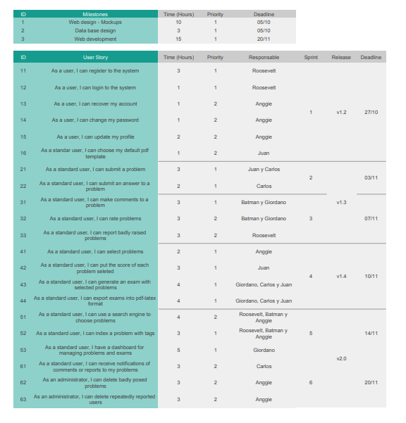
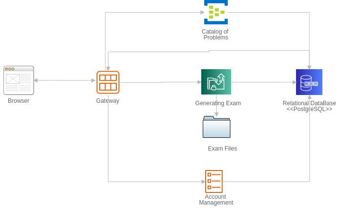
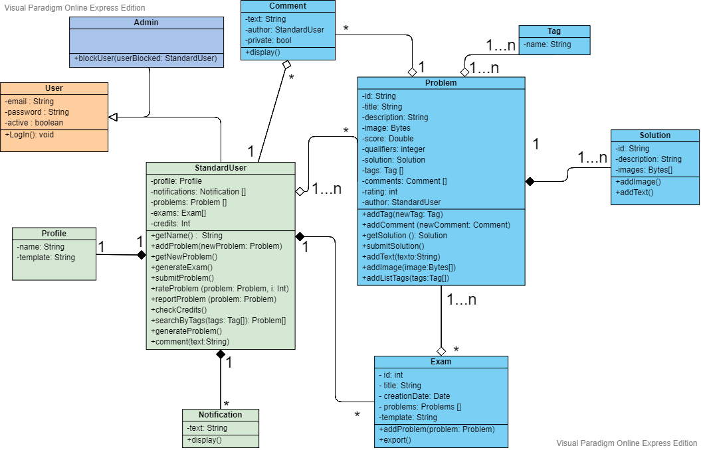
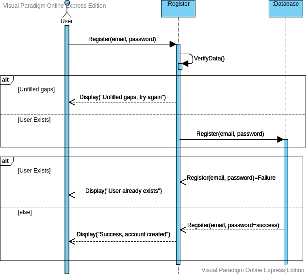
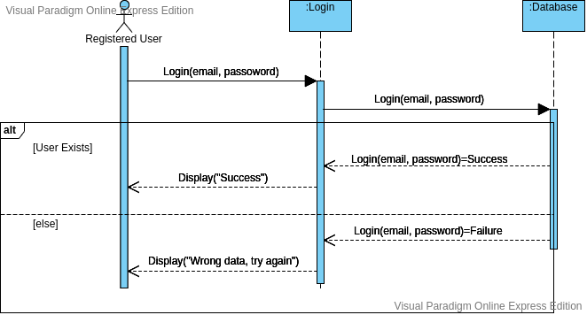
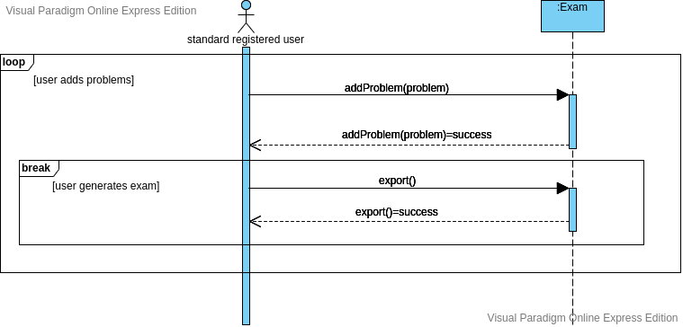
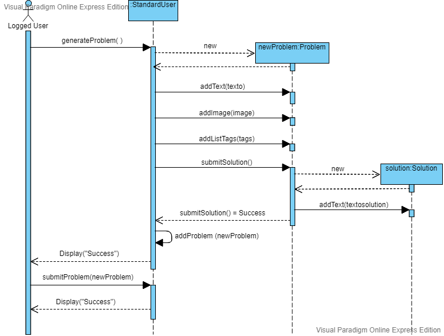

# Developer Guide: Easy Exam - Group 2

## Introduction

EasyExam is an online platform aiming to help professors to generate questions for the exams that they wish to take their students. EasyExam will allow the user to submit questions with their respective answer and store them on a database for other users to be able to search and recover them. The platform encourages collaboration with the user by implementing a 3x1 system in which the user is required to send a question in order to receive 3 in exchange.
EasyExam's will use Java,  Javascript and Spring Boot for the back-end; Vue.js and Vuex for the front-end; and PostgreSQL for the database.

## Features

## Design

### Architecture Diagram

### Class Diagram

## Interaction between components

### Register

### Login

### Generate Exam

### Problem Submition

## Glosary

- **User Interface (UI)**: Medium by which the user interacts with the device. In this case it will be the buttons and text entries of the application.

- **User Experience (UX)**: It refers to the quality of the interaction from the user's perspective.

- **Natural Language**: It is any human language that has evolved naturally with use.

- **Comunication Protocol**: It is a system of rules that allows two or more entities of a communication system to exchange information.

- **HTTP/1.1**: One of the most used *communication protocols on the Internet*.

- **Application Programming Interface(API)**: Set of routines of a program which can be accessed through communication protocols such as HTTP/1.1.

- **Request**: It is an order that is made to a program, this can be of various types. The effects can be different depending on the type.

- **Client**: Sends requests to a server.

- **Server**: Expect requests from some client and return responses to it.

- **Response**: To put it simple, it is understood as the response from the server to the client as an effect of having received a request.

- **Front-end**: The implementation of a UI design.

- **Back-end**: The implementation of the procedures that the application should follow.

- **Transmission Control Protocol (TCP)**: It is one of the main protocols that make up the Internet.

- **Websocket**: It is a \*communication protocol that provides two-way communication at the same time via a TCP connection.

- **Platform**: It is the environment in which a piece of software is executed.

- **Cloud computing service**: Provides technology as a service through the Internet or a dedicated network.

- **Amazon Web Services (AWS)**: It is a cloud computing services platform.

- **Programming language**: Formal language used to implement programs.

- **Javascript**: Programming language used to implement the logical part of the front-end.

- **Status Code**: Indicates whether a request has been completed or not.

- **Controller**: Process the request and perform actions on the models.

- **Model**: Handles the information, logic and rules of the application.

- **Database (DB)**: It is an organized data collection.

- **Object Oriented Programming (OOP)**: It is a paradigm of programming that is based on objects. These objects can
contain information and possess routines, known as methods.

- **Object oriented programming language**: Programming language that implements OOP.

- **Object-relational Mapping (ORM)**: It is a technique used to convert information between systems using an object-
oriented programming language.

- **Java**: It is an object-oriented programming language. It will be used to implement the application's back-end.

- **Hibernate ORM**: It is a tool that implements ORM and can be used with Java.

- **Library**: Set of implementations used by a program.

- **Markup Language**: Language that uses tags to define elements within a document.

- **Cascading Style Sheets (CSS)**: A language used to describe the presentation of a document. It is written in markup
language.

- **Hyper Text Markup Language(HTML)**: A markup language used to describe the structure of a web page.

- **Framework**: An abstraction that provides generic functionalities that can be implemented by the user.

- **Spring Boot**: Program that facilitates the implementation of a Spring based application.
