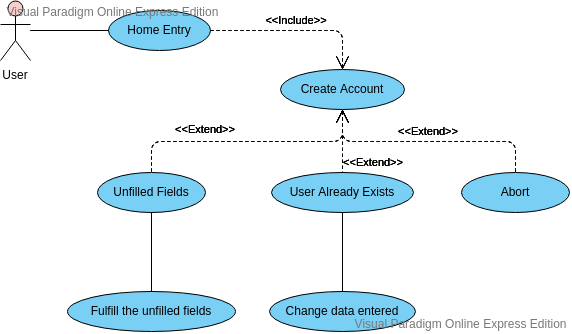

# User Guide: EasyExam - Group 2

## Introduction
EasyExam is an online platform aiming to help teachers to generate relevant questions for the exams that they wish to take their students. EasyExam works on a 3-1 system in which each the user sends one question for every 3 they will recieve in order to encourage the collaboration within the platform. The users can also download the generated exams in PDF-Latex format.

***
## Requirements

The basic requirements for the platform are divided into:

### Functional:

- The platform must allows register, login and recovery of user accounts.
- The platform will allow to submit of new problems and answers from users.
- The platform will allow to users generate exams from a set of problems.
- The platform will have the ability to export the generated exams into PDF-Latex format.
- The platform will allow the user to rate questions.

### Non-functional:

- Access to the platform should be intuitive. Users must be able to find and use problems easily.
- The platform should work with low-spec computers (both in hardware and software).
- The platform should register questions and answers in a short time.
- Features should be written in the java language.
- The platform should sort the problems according to difficulty, acceptance rating and subject.
- The platform should allow users to freely and safely navigate the platform. 

***
## Features

- Account management (login, register and recovery).
- Problem and answer submission.
- Generation of an exam with selected problems.
- Export exams to pdf-latex format.
- Search engine and keyword indexation of problems.
- Dashboard for managing problems or exams.

***
## Target User Profile

The system has two types of users: Administrator and Common user; but we focus on the last user since the function of the first is to manage the database. The project will initially focus only on universities so that the sample is delimited.The common users are those who seek questions for the creation of their exams or who want to raise problems. Administrator user is considered to be a person with knowledge in computer science and database.

## Value Proposition

For the common users, a platform will be offered that will allow them to obtain a set of three problems and exam solutions, in return they have the obligation to upload a private o prublic problem and their respective solution. 
For administrator users, a platform will be offered.

## User Stories

### Must-to-have

* As a user, I can login to the system
* As a user, I can recover my password
* As a teacher, I can comment and report badly raised problems
* As a teacher, I can upload my problems to the system
* As a teacher, I can generate a PDF and Latex file from created exams

### Nice-to-have

* As a user, I can update my profile
* As a teacher, I can know the difficulty of the problem based on the qualifications of other teachers
* As a teacher I can see how many people have rated a problem
* As a teacher I can rate the difficult of questions and comment on them

### Unlikely-to-have

* As a teacher I can export my exams in different formats

***
## Use Cases

### Software: EasyExam
### Actor: User
### Requirement: None
### Use Case: UC01 - Account creation

1. User enters EasyExam's web page
2. User clicks on register
3. System redirects to Register page
4. User fills the registration form
5. User clicks Create Account
6. System creates the account and redirects the user to home

### Extentions:

- 5a. System detects unfilled fields on the registration form
- 5a1.  System asks the user to fulfill the unfilled fields
- 5a2. User fills the fields
- Repeat until user creates an account successfully 

- 5a. System detects that there is already a user registered with that information
- 5a1. Redirects back to the registration form and tells the user there is someone already registered with that information
- Repeat until user inputs different info

- *a User cancels registration
- *a1. System redirects user back to the home page

### Software: EasyExam
### Actor: User
### Requirement: User is logged
### Use Case: UC02 - Registering a new question/answer

1. Logged user clicks on Submit a question
2. User fills the fields for the question
3. User clicks Next
4. User fills the fields for the answer
5. User clicks Submit
6. User redirects to confirmation page
7. User clicks on finish button
8. User gets redirected to the dashboard

### Extentions: 

- 5a. System detects unfilled fields on the form
- 5a1.  System asks the user to fulfill the unfilled fileds
- 5a2. User fills the fields
- Repeat until user submits a question successfully

- *a User cancels Submition
- *a1. System redirects user back to the dashboard

### Software: EasyExam
### Actor: User
### Requirement: User is logged, user added problems (UC04)
### Use Case: UC03 - User downloads the exam

1. User clicks generate
2. System redirects user to the exam generation page
3. User clicks on the format he wants to download the exam in 
4. System downloads the exam into the user's PC

### Extentions: 

- *a User cancels Submition
- *a1. System redirects user back to the dashboard

### Software: EasyExam
### Actor: User
### Requirement: User is logged
### Use case: UC04 - User adds a question to the exam

1. User selects a problem from the dashboard
2. System pops up the problem's window
3. User Clicks on get problem 
4. System adds the problem to the exam the user is generating

### Extentions:
- *a User Cancels Submition
- *a1. System redirects user back to the dashboard

### Software: EasyExam
### Actor: User
### Requirement: User is logged
### Use case: UC05 - Report a problem

1. User selects a problem from the dashboard
2. System pops up the problem's window
3. User Clicks on report
4. System pops up a report window
5. User fills on the fields to report the problem
6. User clicks on submit report

### Extentions:

- 5a. System detects unfilled fields on the form
- 5a1.  System asks the user to fulfill the unfilled fields
- 5a2. User fills the fields
- Repeat until user creates a report successfully

- *a User Cancels Submition
- *a1. System redirects user back to the dashboard

### Software: EasyExam
### Actor: User
### Requirement: None
### Use case: UC06 - Account recovery

1. User enters EasyExam's web page
2. User selects forgot password
3. System redirects to recovery page
4. User fills the fields 
5. User clicks on submit
6. System sends an account recovery email to the user

### Extentions:

- 5a. System detects unfilled fields on the form
- 5a1.  System asks the user to fulfill the unfilled fields
- 5a2. User fills the fields
- Repeat until user sends

- *a User Cancels Submition
- *a1. System redirects user back to the dashboard

***
## Glossary

- **3x1 rule:** upload a problem and get access to three ones
- **User:** a person who uses the platform
- **Common user:** a user who can upload and get public and private problems
- **Account:** unique credential that allows a user to access the platform
- **Login:** a credential validation procedure to access the platform
- **Activation email:** email that allows to activate an account
- **Dashboard:** control panel of the platform
- **Problem:** a question to be answered
- **Preview:** problem statement without solution
- **Solution:** answer to a problem with detailed procedure or rationale
- **Answer key:** quick answer to a problem, without procedure
- **Submit:** action of uploading a problem to the platform
- **Report:** action of sending a written observation to a problem that is not well posed, with writing errors or wrong solution
- **Tags:** problem indexing system
- **PDF-latex:** pdf version of a document generated in Latex

***
