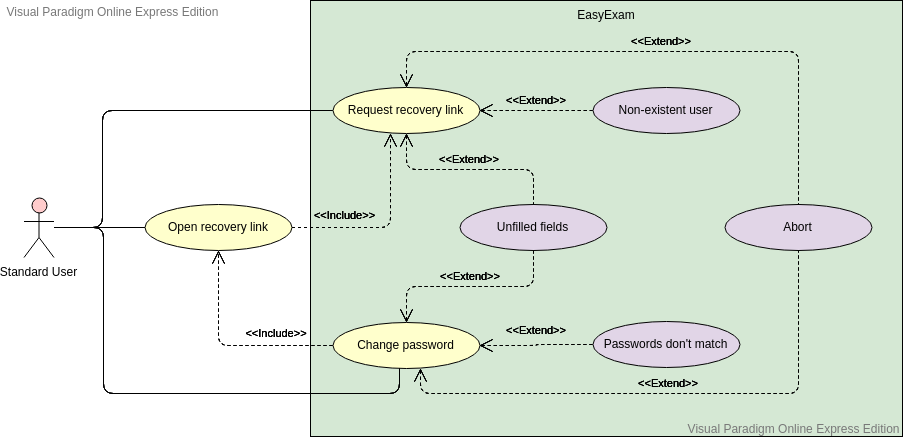

# User Guide: EasyExam - Group 2

## Introduction
Easy Exam is an integrated web service for exams generation aimed at university teachers. This includes access to a limited bank of problems proposed by the community of standard users. To guarantee the quality and growth of this bank, standard user must collaborate using the 4x1 system.  In addition, it has a tool that facilitates the generation of their exams in a pre-established format based on certain selected problems.

***

## Target User Profile

The system has two types of users: Administrator and Standard user.
- Standard user: Any user registered to Easy Exam
- Administrator user: Administrates the service. Has the ability to modify problems and block/delete users. It is considered to be a person with knowledge in computer science and database.

*** 

## Requirements

The basic requirements for the platform are divided into:

### Functional:

- The system must allow the account management.
- The system must allow the standard users to submit new problems with their respective solutions.
- The system must allow the standard users generate exams
- The system must allow the standard users to download the generated exam.
- The system must allow the standard users to rate problems.
- The system must display the problems according to a criteria.
- The system must allow the user to search for problems based on topics tags.
- The system must allow the admin users to block standard users.

### Non-functional:

#### Operational Requirements
- The system should be intuitive to use. At least 95% of Easy Exam users should not need to read the user guide to be able to use the system.

#### Performance Requirements
- The system’s first startup should take less than 3 seconds. Then, with the use of the cache, it should take less than 1 second.
- The system’s database should be able to support and handle thousands of users and questions.
- Queries on the database shouldn’t take more than 1 second
- The system should have a response time of under five seconds.
- The system should be able to handle 10 000 users without affecting its performance
#### Security Requirements
- The system should be able to keep a registry of the blocks and bans given to standard users.
#### Portability Requirements
- The system web should be responsive and can be managed both in mobile and desktop devices.

***

## Features

- Account management (register, activation, login and recovery account).
- Problem and answer submission.
- Generation of exams with selected problems.
- Export exams to PDF format.
- Search engine and keyword indexation of problems.
- Dashboard for managing problems or exams.
- Problem feedback (suggest changes and report a problem).

***

## User Stories

### Must-to-have

- [Epic] As a standard  user, I can manage my account.
  - As a standard user, I can activate my account
  - As a standard user, I can register
  - As a standard user, I can login
  - As a standard user, I can change my password
  - As a standard user, I can recover my account
- As a standard user, I can comment problems
- As a standard user, I can report poorly formulated problems
- As a standard user, I can create a new problems with their respective solution
- As a standard user, I can generate an exam so that I can download it as a PDF file.
- As a standard user, I can rate the difficulty of problems so that other standard users can see the average score of any problem.
- As a standard user, I can comment problems so that other standard users can see my comments.
- [Epic] As an administrator, I can manage standard users’ account.
  - As an administrator, I can suspend a standard users account.
  - As an administrator, I can delete a standard users account.

### Nice-to-have

- As a standard user, I can choose my topics of interest so that problems related to this topic will appear first.
- As a standard user, I can suggest modifications to a problem so that the problem owner can see my suggestick and correct it later.
- As a standard user, I can update my profile
- As a standard user, I can know the difficulty of the problem based on the qualifications of other standard users
- As a standard user, I can get notified when someone reports or comment my problem
- As a standard user, I can see how many people have rated a problem
- As a standard user, I can generate an exam with random problems from the database
- As a standard user, I can save problems I have recently tried.
- As a standard user, I can send feedback of EasyExam.
- As a standard user, I can get a new problem if I my report is accepted. 
- As an administrator user, I can make a standard user an administrator user

### Unlikely-to-have

- As a standard user, I can export my exams in different formats
- As a standard user, I can see if my problem is written correctly.
As a standard user, I can see if my problem is copied.

***

## Use Cases

**Software:** EasyExam

**Actor:** User

**Requirement:** None

**Guarantees:** 
- User will be registered in the system.
- All fields filled by the user will be save for the system

**Use Case:** UC01 - Account management
1. User enters EasyExam's web page
2. User chooses between login, register or recovery account
3. System redirects to selected page
4. User fills the form
5. System check the information
6. Use Case ends

**Extensions:**
- 5a. System detects unfilled fields on the form.
  - 5a1.  System asks the user to fulfill the unfilled fields.
  - 5a2. User fills the fields.
  - Repeat until user creates an account successfully.
- 5b. System detects that there is already a user registered with that information.
  - 5b1. Redirects back to the registration form and tells the user there is someone already registered with that information.
  - Repeat until user inputs different info.
- *a. User cancel request
  - *a1 System requests to confirm the cancellation.
  - *a2 System returns to "Login Page".

**Diagram**
  

**Software:** EasyExam

**Actor:** User

**Requirement:** User is logged and logged in

**Guarantees:** 
- All problems and answer's fields filled by the user will be save for the system

**Use Case:** UC02 - Register a new problem and solution
1. User enters the problems and answers registration page
2. User fills the problem and solution fields
3. System verifies the information
4. System saves problem and answer
5. User is redirected to the dashboard
6. Use Case ends

**Extensions:**

- 3a. System detects unfilled fields on the form
  - 3a1.  System asks the user to fulfill the unfilled fields
  - 3a2. User fills the fields
  - Repeat until user submits a problem and answer successfully
- *a. User cancels request
  - *a1. System redirects user back to the dashboard

**Diagram**
  

**Software:** EasyExam

**Actor:** User

**Requirement:** User is logged and logged in

**Use Case:** UC03 - User adds a problem to the exam

1. User enters the dashboard
2. User selects the problems
3. System adds the problem to the exam that user is generating
4. Use Case ends

**Extensions:**
- *a. User cancels request
  - *a1. System redirects user back to the dashboard

**Diagram**
  

**Software:** EasyExam

**Actor:** User

**Requirement:** User is logged and logged in. User added problems (UC03)

**Use Case:** UC04 - User downloads the exam

1. User enters to the exam generation page
2. User downloads the exam
3. System downloads the exam on the user's PC
4. Use Case ends

**Extensions:**

- *a User cancels request
  - *a1. System redirects user back to the dashboard

**Diagram**
  

**Software:** EasyExam

**Actor:** User

**Requirement:** User is logged and logged in

**Use Case:** UC05 - Report a problem

1. User selects a problem from the dashboard
2. System pops up the problem's window
3. User report the problem
4. System pops up a report window
5. User fills on the fields to report the problem
6. System check the information
7. Use Case ends

**Extensions:**

- 6a. System detects unfilled fields on the form
  - 6a1.  System asks the user to fulfill the unfilled fields
  - 6a2. User fills the fields
  - Repeat until user creates a report successfully
- *a User Cancels request
  - *a1. System redirects user back to the dashboard

**Diagram**
  

**Software:** EasyExam

**Actor:** User

**Requirement:** User is logged

**Use Case:** UC06 - Account recovery

1. User enters the account recovery page
2. User fills the fields
3. User submit the information
4. System sends an account recovery email to the user
5. When user opens link, system redirects it to a screen to recover password
6. User fills the fields
7. User submit the new password
8. Use Case ends

**Extensions:**

- 3a. System detects unfilled fields on the form
  - 3a1.  System asks the user to fulfill the unfilled fields
  - 3a2. User fills the fields
  - Repeat until user sends
- 7a. System detects unfilled fields on the form
  - 7a1. System asks the user to fulfill the unfilled fields
  - 7a2. User fills the fields
- *a User cancels request
  - *a1. System redirects user back to the dashboard

**Diagram**
  

***

## Glossary

- **4x1 rule:** upload a problem and get access to three ones
- **User:** a person who uses the platform
- **Standard user:** a user who can upload and get public and private problems
- **Account:** unique credential that allows a user to access the platform
- **Login:** a credential validation procedure to access the platform
- **Activation email:** email that allows to activate an account
- **Dashboard:** control panel of the platform
- **Problem:** a question to be answered
- **Preview:** problem statement without solution
- **Solution:** answer to a problem with detailed procedure or rationale
- **Answer key:** quick answer to a problem, without procedure
- **Submit:** action of uploading a problem to the platform
- **Report:** action of sending a written observation to a problem that is not well posed, with writing errors or wrong solution
- **Tags:** problem indexing system
- **PDF-latex:** pdf version of a document generated in Latex

***
